Relativity Trace Documentation
================================

- [Release Notes](#release-notes)
- [Introduction to Relativity Trace](#introduction-to-relativity-trace)
- [Prerequisites](#prerequisites)
    + [Agents](#agents)
    + [Applications](#applications)
- [Setting up Relativity Trace](#setting-up-relativity-trace)
- [Trace Document Flow Overview](#trace-document-flow-overview)
  * [Error Resolution Workflow and Retry](#error-resolution-workflow-and-retry)
- [Trace Rules Engine Overview](#trace-rules-engine-overview)
  * [1 - Creating a Rule](#1---creating-a-rule)
  * [2 – Customizing and Running a R­ule](#2---customizing-and-running-a-r-ule)
  * [3 - Validating Results](#3---validating-results)
  * [Terms](#terms)
    + [Creating Terms](#creating-terms)
    + [Highlighting](#highlighting)
  * [Actions](#actions)
    + [Move To Folder Action Type](#move-to-folder-action-type)
    + [Data Archive Action Type](#data-archive-action-type)
    + [Advanced Action Type](#advanced-action-type)
    + [Alert Action Types](#alert-action-types)
    + [Trace Replacement Tokens](#trace-replacement-tokens)
      - [Email Action Type](#email-action-type)
      - [Slack Action Type](#slack-action-type)
      - [Webhook Action Type (Preview)](#webhook-action-type--preview-)
    + [Trace Custom Scripts](#trace-custom-scripts)
- [Trace Proactive Ingestion Framework](#trace-proactive-ingestion-framework)
  * [Data Sources](#data-sources)
    + [Microsoft Exchange Data Source](#microsoft-exchange-data-source)
    + [Relativity Native Data Extraction Data Source](#relativity-native-data-extraction-data-source)
    + [Trace Monitored Individuals](#trace-monitored-individuals)
    + [Trace Data Transformations](#trace-data-transformations)
    + [Replace Data Transformation](#replace-data-transformation)
    + [Deduplication Data Transformation](#deduplication-data-transformation)
  * [Data Batches](#data-batches)
    + [Error Resolution Workflow and Retry](#error-resolution-workflow-and-retry-1)
    + [Automatic Discovery of Monitored Individuals](#automatic-discovery-of-monitored-individuals)
- [Setup](#setup)
  * [Tasks](#tasks)
  * [Alerts and Notifications](#alerts-and-notifications)
  * [Errors and Logging](#errors-and-logging)
- [Reporting](#reporting)
  * [Trace Terms Report](#trace-terms-report)
- [Considerations](#considerations)
  * [Usability Considerations](#usability-considerations)
  * [Infrastructure and Environment Considerations](#infrastructure-and-environment-considerations)
- [Glossary](#glossary)
- [Appendix A: Trace Object Architecture](#appendix-a--trace-object-architecture)
- [Appendix B: Trace Document Extraction Fields](#appendix-b--trace-document-extraction-fields)
- [Appendix C: Create Email Fields Map Integration Point Profile](#appendix-c--create-email-fields-map-integration-point-profile)

> Please contact trace@relativity.com with any questions!

Release Notes
================================

**Trace Version:** 11.2.9.2

**Release Date:** 15 July 2019

**Relativity Compatibility:** > 9.6.202.10


**New Features**
-   BIST auto-run automation
-   In production, you can dedicate a workspace for continuous integration
    testing and enable automatic execution of tests ensuring the infrastructure
    is in good shape
-   Full configuration of tasks, actions, data sources is now formally exposed
    via custom field store UI

**Enhancements**
-   BIST now includes additional coverage and verification
-   Reporting task now utilizes kCura.Notification encrypted instance settings
    for email configuration
-   Email (alert) action now utilizes kCura.Notification encrypted instance
    settings for email configuration
-   Data Sources now report transient errors directly on the object and not
    generate data batches with errors - this reduces manual involvement with
    resolving data batch errors
-   Various performance optimizations for workspaces with large number of
    documents
-   Additional metrics surrounding data retrieval and extraction process are now
    added as part of Telemetry reporting
-   Globanet data sources configuration for monitored individuals is now
    streamlined via CSV file

**Defect Fixes**
-   Excessive accumulation of .net threads (resources) during Trace Exchange
    data retrieval process
-   Embedded attachments inside of MS Office files and other containers are now
    correctly extracted
-   Addressed feedback from security penetration testing

**Deprecated**
-   Trace Office 365 data source (based on GraphAPI) is deprecated. Use Trace
    Exchange data source instead

**Upgrade Considerations**
-   In order to enable BIST on the workspace you need to update
    TraceWorkspaceSettings instance setting
-   Data Sources with Fileshare source path configurations are now explicitly
    validated to be within the workspace Fileshare bounds. You must adjust the
    Source Path settings for each impacted data source to be relative folder
    path within the default Fileshare configured for the workspace

Introduction to Relativity Trace
================================

Relativity is primarily used for e-discovery, investigations and regulatory
inquiries: typically reactive and transactional workflows. Relativity Trace is
an application built on the Relativity platform for proactive compliance and
surveillance workflows.

Relativity Trace is an [ADS Deployable
Application](https://platform.relativity.com/9.5/Content/Building_Relativity_applications/Building_Relativity_applications.htm)
containing
[RDOs](https://platform.relativity.com/9.5/Content/Managing_Relativity_dynamic_objects/RDO_9.5/Relativity_objects.htm),
Custom
[Agents](https://help.relativity.com/9.5/Content/System_Guides/Agents_Guide/Agents.htm),
[Event
Handlers](https://help.relativity.com/9.5/Content/Relativity/Event_Handler_Express/Relativity_Event_Handler_Express.htm)
and other relevant infrastructure.

Prerequisites
=============

Ensure the default Relativity infrastructure has been setup and operational. In
addition, Relativity Trace utilizes the following components for its processes:

### Agents

-   dtSearch Index Manager

-   dtSearch Index Worker

-   dtSearch Search

-   Application Installation Manager

-   Auto Batch Manager

-   Integration Points Agent (need to install [Relativity Integration
    Points](https://platform.relativity.com/9.6/Content/Relativity_Integration_Points/Get_started_with_integration_points.htm?)
    first)

-   Integration Points Manager (need to install [Relativity Integration
    Points](https://platform.relativity.com/9.6/Content/Relativity_Integration_Points/Get_started_with_integration_points.htm?)
    first)

If you plan to use Analytics functionality, please also make sure the following
agents are set up:

-   Content Analyst Index Manager

-   Content Analyst Cluster Manager

-   Analytics Categorization Manager

-   Analytics Index Progress Manager

-   Active Learning Manager

-   Active Learning Worker

-   Structured Analytics Manager (need to install [Relativity
    Analytics](https://help.relativity.com/9.6/Content/Relativity/Analytics/Structured_analytics_set_tab.htm)
    first)

-   Structured Analytics Worker (need to install [Relativity
    Analytics](https://help.relativity.com/9.6/Content/Relativity/Analytics/Structured_analytics_set_tab.htm)
    first)

### Applications

-   [Relativity Integration
    Points](https://platform.relativity.com/9.6/Content/Relativity_Integration_Points/Get_started_with_integration_points.htm?)

    1.  Used by Trace Data Sources

    2.  See this
        [page](https://help.relativity.com/9.6/Content/Relativity_Integration_Points/RIP_9.6/Installing_Integration_Points.htm)
        for details on how to install Integration Points

-   [Relativity
    Analytics](https://help.relativity.com/9.6/Content/Relativity/Analytics/Structured_analytics_set_tab.htm)

    1.  Used by Trace after ingestion to perform Structured Analytics workflows
        (language identification, repeated content identification, etc)

Setting up Relativity Trace
===========================

1.  [Install](https://help.relativity.com/9.6/Content/Relativity/Applications/Installing_applications.htm)
    the Trace_\<version\>.rap from Application Library tab to all workspaces
    where needed

2.  Validate application install in the workspace with Trace application
    installed

    

3.  Create Trace agent

    1.  Agent Type = “Trace Agent”

    2.  Number of Agents = “1” (**Note: creating multiple Trace Agents in a
        Relativity instance is not supported and will cause failures and/or
        unpredictable behavior)**

    3.  Agent Server = Select the agent server you would like the agent deployed
        on (see “Infrastructure and Environment Considerations” section for
        optimal performance)

    4.  Run Interval = “60”

    5.  Logging level of event details = “Log all messages”

4.  Please review the
    [Considerations](#infrastructure-and-environment-considerations) for system
    impact information. By default system processes (Tasks) are scheduled to run
    every 5 minutes (configurable per workspace).

    1.  Please reach out to <trace@relativity.com> for additional information

5.  Configure Trace License

    1.  At first install time, a default trial license is installed that is
        re-used for all workspaces in the Relativity instance (it’s valid 30
        days from installation date)

    2.  You can request a new license via “Manage Trace License” link on Setup
        tab

        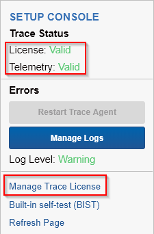

    3.  Click “Request Trace License” and send an email with the contents of the
        request to <trace@relativity.com>

        

>   **WARNING:** Once license expires, all Trace processes stop working in all
>   configured workspaces.

1.  In the workspace, navigate to the Trace:Setup tab and set the “Run Option”
    to “Continuous”

**WARNING:** Changing the “Run Option” to “Continuous” will automatically build
a dtSearch index for this workspace for all documents present. Only change this
setting to "Continuous" when appropriate agent infrastructure is configured and
disk space available to build a corresponding dtSearch Index. Please reach out
to <trace@relativity.com> for support on installing Trace into workspaces with
existing data.

Trace Document Flow Overview
============================

Trace has a three-step process that all new documents go through. This status is
tracked in the “Trace Document Status” field.

|             | **Step 1**                                                                      | **Step 2**                                    | **Step 3**                                                            |
|-------------|---------------------------------------------------------------------------------|-----------------------------------------------|-----------------------------------------------------------------------|
| **Status:** | **NEW**                                                                         | **INDEXED**                                   | **TERM SEARCHED**                                                     |
| Overview:   | Documents that are brand new and are part of *Trace All Documents* saved search | Documents that have been successfully indexed | Documents that have been successfully searched by Term Searching task |

As documents flow into Relativity workspace and through Trace workflow the
status of documents is reflected on a few key fields on the Document object

1.  **Trace Checkout** – Fixed-length Text field responsible for checking out
    each document for the Trace Data Flow

2.  **Trace Document Status** – Single choice field responsible for reflecting
    overall progress of the document through the Trace Data Flow

    1.  Standard choices are “1 – New”, “2 – Indexed”, and “3 – Term Searched”
        reflecting the statuses above

    2.  “Indexing Errored” – reflects documents that have not successfully gone
        through Indexing. Potential causes:

        1.  Broken infrastructure (Agents, Service Host)

        2.  Documents could not be updated with new status due to SQL outage

        3.  Actions:

            1.  Check Setup tab for statuses of agents

            2.  Check Trace logs (via Manage Logs console button)

            3.  Perform Trace Document Retry mass-operation on affected
                documents

    3.  “Searching Errored” – reflects documents that have not successfully gone
        through Term Searching.  
        Potential causes:

        1.  Broken infrastructure

            1.  Disabled agents

            2.  Stopped services (agent manager, service host)

        2.  Permanently broken/invalid Term syntax are present

        3.  Actions:

            1.  Check Setup tab for statuses of agents

            2.  Check Terms tab for detailed errors on each failed term

            3.  Check Trace logs (via Manage Logs console button)

            4.  Perform Trace Document Retry mass-operation on affected
                documents

3.  **Trace Document Terms** – MultiObject field tracking which Terms have
    matched a document

4.  **Trace Document Rule Terms** – MultiObject field tracking Rule specific
    Terms (terms that are associated with any rule) that have matched a document

5.  **Trace Has Errors** – Boolean (yes/no) field indicating if the document has
    any errors related to ingestion, extraction

6.  **Trace Error Details** – Long Text field capturing the error details if a
    document has encountered any errors

7.  **Trace Data Transformations** – MultiObject field tracking what data
    transformations have been applied to the document as part of ingestion
    (note, currently only data transformations of type Replace are attached to
    documents)

You can get a quick understanding of the status of your system and documents by
applying appropriate aggregations and dashboards on these fields:


**NOTE:** Rule evaluation (including tagging documents to the Rule) is executed
by the Rule Evaluation task and is outside of the core Trace Document Flow.

Error Resolution Workflow and Retry
-----------------------------------

If you wish to re-submit existing documents through the Trace Data Flow, you can
accomplish this via Document mass operation “Trace Document Retry”. The mass
operation resets the following fields: “Trace Checkout”, “Document Term”,
“Rules” and “Trace Document Status”. Simply check the documents that you wish to
retry from the Document List and click the item in the dropdown and click “Ok”
on the pop-up. If your browser settings prevent pop-ups please enable them for
Relativity URLs.

**WARNING:** The retry process can be very resource-intensive. Trace is
optimized for ongoing and forward-looking use cases where documents are only
searched once upon ingestion. Triggering a retry will treat affected documents
as if they were brand new to Trace, clearing all previous Rule and Term
associations. If enough documents are retried at once, the system could struggle
to handle the sudden influx of documents. Please exercise caution when using
this feature.


Trace Rules Engine Overview
===========================

The Trace Rules Engine allows users to define data buckets with specific
triggers and actions. These Rules are executed on periodic basis at
pre-configured intervals, allowing users to automatically categorize and tag
documents as they are ingested into the workspace.

1 - Creating a Rule
-------------------

Create a new [rule](#_Glossary) by clicking “New Rule” on the Trace:Rules tab


The Rule Creation form contains the following fields:

-   **Name:** the name of the rule

-   **Searchable Set:** the document set searched when the Rule runs. Make sure
    this set contains all documents that should be considered by Trace Rules.

-   **Associated Actions:** actions are what happen when a rule matches a
    document. Currently supported Action Types are:

    -   **Tagging**: tags documents with the associated rule (happens
        automatically as part of Rule Evaluation)

    -   **Data Archiving**: triggers deletion of specified documents after the
        configured retention policy

    -   **Advanced:** execute customer provided Relativity Script

    -   **Email:** generates an email with metadata about alerted documents

    -   **Slack:** generates a Slack message with metadata about alerted
        documents

    -   **Webhook:** makes a generic API hosted within Relativity

-   **NOTE:** Batching action has been deprecated. You can still create a Batch
    Set manually from any saved search.

2 – Customizing and Running a R­ule
-----------------------------------

After you create a Rule, use the Rule definition page to Enable and Customize
the rule.

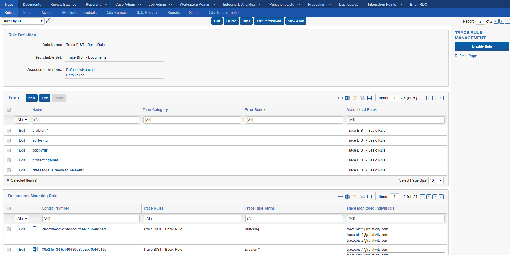

The Trace Rule Management Console on the right-hand side has the following
buttons:

-   **Enable Rule:** enabling the rule allows agents to run rule on an ongoing
    basis

**NOTE:** A Rule will only execute when it is enabled.

In addition, Rules use Terms as part of additional filtering available to
identify your documents of interest. You can create new or link existing Terms
directly from Rule layout. Terms created this way will automatically be
associated with the Rule during evaluation.

3 - Validating Results
----------------------

After Rule executes, documents matching the Rule will be associated to the Rule
itself.

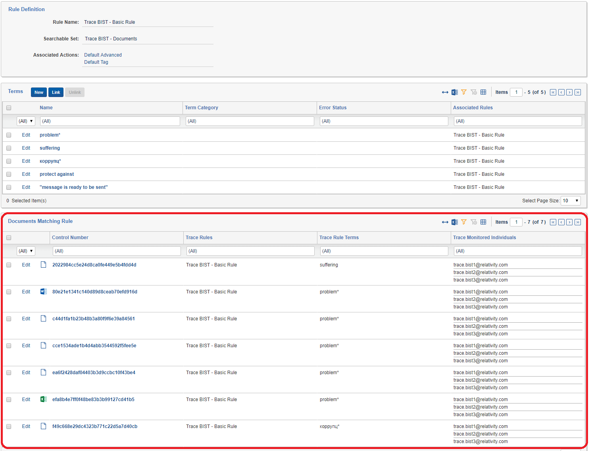

Terms
-----

In addition to metadata conditions of a Saved Search associated with Rule, you
can apply extensive searching criteria to isolate only the most relevant
documents.

### Creating Terms

You can create Terms in multiple ways:

1.  Via [Remote Desktop Client
    (RDC)](https://help.relativity.com/9.6/Content/Relativity/Relativity_Desktop_Client/Relativity_Desktop_Client.htm)
    load file. This method is ideal if you are adding a lot of terms at once.

2.  From Terms tab by clicking “New Term” and adding each Term individually.

3.  By clicking the New button on the Terms section of the Rule Layout.


Term definition contains 3 fields:

-   **Term:** searching string (unique identifier)

-   **Term Category:** optional group name to organize terms

-   **Relativity highlight color:** specifies highlighting configuration in the
    Relativity viewer (see [highlighting](#highlighting) section)

In addition, you can see and modify Term Categories and Rules associated with
Term and its status with regards to execution

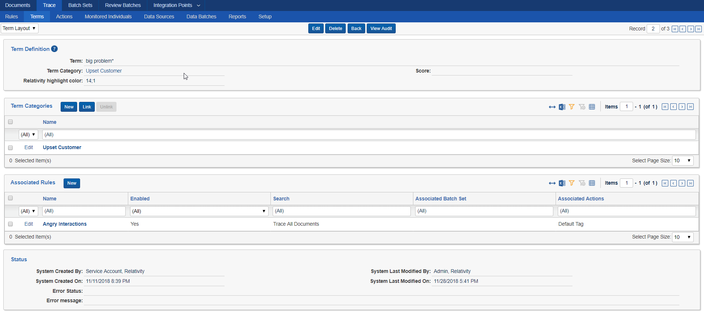

**NOTE:** The Term “Name” (actual text being searched) **cannot** be modified
after it is created. You must remove and add a new term object to change the
search string. You **can** modify the highlight color and term category of an
existing term.

**NOTE: The** Term “Name” (actual text being searched) is limited to 450
characters. Please reach out <trace@relativity.com> if your use-case requires
higher limits for your terms.

### Highlighting

By default, Trace creates a “Trace Persistent Highlight Set” that is populated
with **all** terms present in the workspace. In addition, the “Trace Rules
Persistent Highlight Set” captures only terms currently associated with any
Rule. You can have many terms you want to use for highlighting purposes only,
and not necessarily as part of matching any specific Rule. You can adjust the
order in which they are displayed in the viewer.


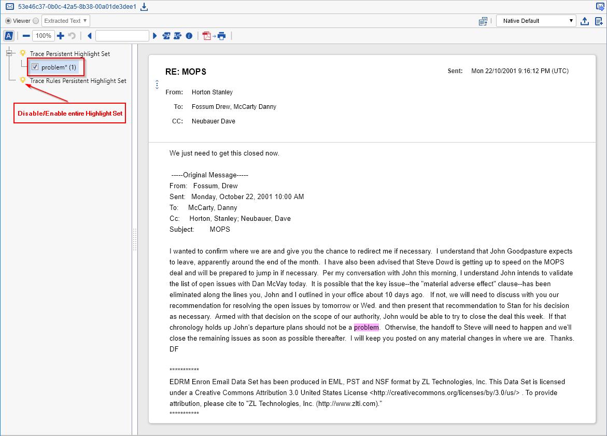

In addition, you can override default highlight configuration (magenta
background and black text) by specifying a semi-colon separated list of
pre-configured color combinations. The details of the color codes can be
accessed via Context Help button on the Term Definition page.


Actions
-------

As part of installation, Action Types are created. Currently supported action
types are: Tag, Data Archive, Advanced, Email, Slack, and Webhook and Move To
Folder. For each Action Type there is a Default Action created. You can also
customize and configure your own Actions.

### Move To Folder Action Type

Move To Folder action works on documents that match Rule criteria. Upon
execution of the action, the documents will be moved to specified document
folder, inheriting folder permissions. This action can be used to effectively
secure the documents to specific set of users/groups. This can also be used to
drive regional review workflow in conjunction with alerting actions.

You can configure the action by specifiying the ArtifactID of the destination
folder where the documents are to be moved. Additional Information section
automatically populates the list of available folders and their corresponding
ArtifactIDs for your conveneince.


### Data Archive Action Type

**WARNING:** The Data Archive Action will permanently delete all documents that
match the Rule conditions and are outside the Data Retention window.

The Data Archive Action Type follows the same Trace Rules Engine paradigm with
one added condition:

-   You attach the Data Archive action to a Rule

-   The rule executes the actions on documents that match the Rule conditions

    -   Searchable Set

    -   Term Searching (optional)

    -   *SPECIFIC TO ARCHIVE*: Workspace Data Retention policy

Any data that is within the data retention policy (from the System Created On
date/time) will not be deleted even if the document is included in the
Searchable Set / Search Term

**NOTE:** By default, the Data Archive Action will delete 1,000 documents per
Run Interval. To adjust configurations so documents can be deleted more
frequently, reach out to <trace@relativity.com>

### Advanced Action Type

**WARNING:** Advanced Action type can execute potentially harmful Relativity
Scripts. Apply rigorous testing and impact assessment prior to deploying any
custom script in production or enabling it to run continuously via Trace
automation. For more information about Relativity Scripts in general, see the
[Scripts](https://help.relativity.com/9.6/Content/Relativity/Scripts.htm) and
[Scripts
Properties](https://platform.relativity.com/9.6/Content/Scripts/Script_properties/Script_properties.htm)
documentation pages.

The Advanced Action Type executes a Relativity Script automatically on a
recurring basis per the Rule Evaluation task configuration (schedule).

To create a Rule with an Advanced action attached, follow the following steps:

**Step 1**: Identify a Relativity Script you want to run automatically or create
one yourself.

-   Script must have Saved Search input parameter with *name* attribute “Saved
    Search”

-   For more information about Relativity Script feature in general, see the
    [Scripts](https://help.relativity.com/9.6/Content/Relativity/Scripts.htm)
    and [Scripts
    Properties](https://platform.relativity.com/9.6/Content/Scripts/Script_properties/Script_properties.htm)
    documentation pages.

**NOTE:** Currently all Relativity Scripts that can be associated with Trace
actions require a Saved Search as one of the script inputs (Trace automatically
populates that field during Rule Evaluation with Rule specific saved search).


**Step 2**: To incorporate your script into the Rule framework, you must create
an Action of Action Type “Advanced”.

-   You can create new advanced actions in the Trace:Actions tab.

-   This custom Action will eventually be attached to a Rule, so be sure to give
    it an easily identifiable name.


Configuration of the action needs to provide all needed script inputs in the
following format:

```json
{
  "Destination Hour Of Day Field Name": "TraceHourOfDay",
  "Destination Day Of Week Field Name": "TraceDayOfWeek",
  "Timezone": "Central Standard Time"
}
```

For reference:

-   “Trace Date Parser” is the displayed script name as seen in the UI

-   “Destination Hour of Day Field Name”, and “Destination Day of Week Field
    Name” are Scripts Input Names

-   “Trace Hour Of Day”, and “Trace Day Of Week” are SQL Column names of
    corresponding Relativity Fields

**NOTE:** Trace will automatically create a Saved Search that includes a
combination of your chosen Saved Search (from the Rule) AND your Term conditions
and use that as the input for the script.

**Step 3**: To execute your script, attach this Action to a Rule and enable it
(as you would with any Rule).

**NOTE:** Advanced actions will run on a schedule, continuously. For scripts
that have the potential to use significant resources, we recommend designing the
script to be aware of what has already been acted on.

### Alert Action Types

Trace supports the following modes of notification: Email, Slack, and Webhook.
These actions can be used as part of any rule.

### Trace Replacement Tokens

You can specify Trace Replacement Tokens in any configuration field for any
Alert Action Type. These tokens will be replaced with information relevant to
the specific document, rule and/or alert:

*\<\<TRACE_RULE_VIEW_LINK_TOKEN\>\>* - view link to Trace Rule in Relativity
that generated the alert

*\<\<TRACE_DOCUMENT_VIEW_LINK_TOKEN\>\>* - view link to Document matched by the
alert

*\<\<TRACE_DOCUMENT_IDENTIFIER_TOKEN\>\>* - Relativity document identifier
(Control Number)

*\<\<TRACE_DOCUMENT_ARTIFACT_ID_TOKEN\>\>* - ArtifactID of the document matched
by the alert

*\<\<TRACE_RULE_NAME_TOKEN\>\>* - Name of the Trace Rule that generated the
alert

*\<\<TRACE_WORKSPACE_ID_TOKEN\>\>* - Relativity Workspace ID (ArtifactID) of the
workspace that generated the alert

#### Email Action Type

You can configure the Email action to send out an email about specific document
matching rule conditions.

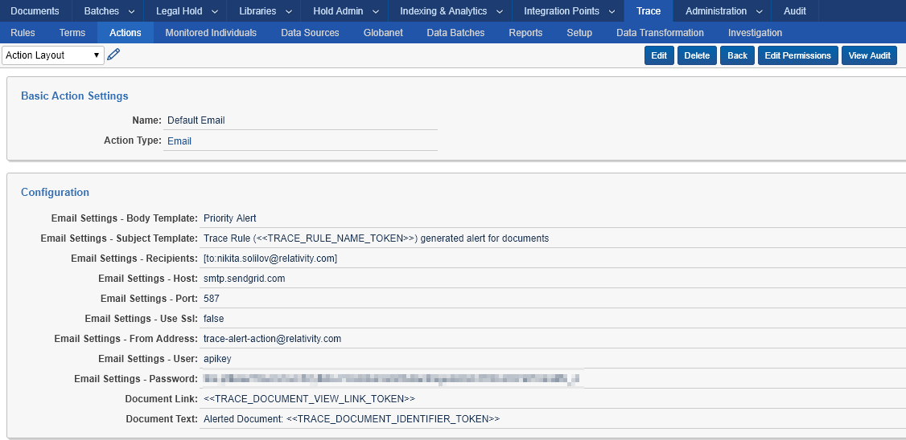

Configuration

Body Template – HTML body of the email (good place to use tokens)

Subject Template – subject of the email (good place to use tokens)

Recipients – recipients of the email (supports to/cc/bcc)

Email Settings (Host /Port / Use SSL / From Address / User / Password) – SMTP
server configuration used to send the email

Document Link / Document Text – allows to specify custom metadata about alerted
documents including custom text and link to document in Relativity

Sample Email generated by Trace

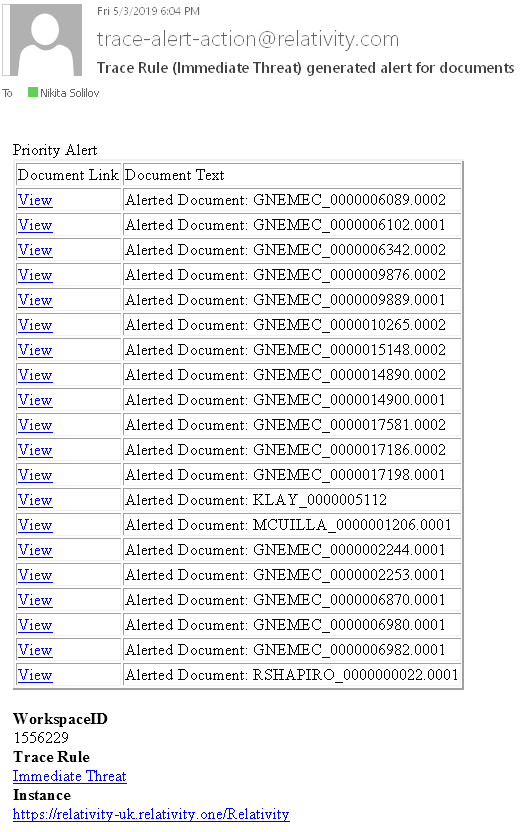

#### Slack Action Type


Configuration

Channel – Slack channel to use for alert

Message Template – text of the alert (good place to use tokens)

User Name – sender of the Slack message

Slack Base Url – what URL to use for Slack alert

Slack Web Hook Id – unique ID of the registered incoming webhook

Document Link / Document Text – metadata and link to alerted documents in
Relativity

**NOTE:** You must register a webhook to specific channel in Slack that will be
allowed to post messages from Trace. Once registered, enter the ID of the
registration into “Slack Web Hook Id” field. For more information visit:
<https://get.slack.help/hc/en-us/articles/115005265063-Incoming-WebHooks-for-Slack>

Sample Slack message generated by Trace

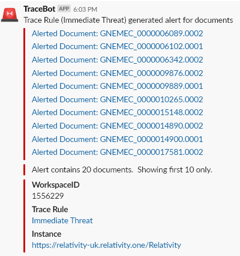

#### Webhook Action Type (Preview)

You can configure an action to make an API call to any web services hosted
within the Relativity infrastructure. For example, you could use the Webhook
action to call RelativityOne notification API to generate a mobile alert for the
documents.


Configuration

Json Payload – custom JSON string containing the payload of the API call (good
place to use tokens)

Web Hook Base Api Url – URL of the Relativity instance hosting the API

Web Hook Api Function – relative path of API method to execute (used in
combination with Base Api Url)

Document Link / Document Text – metadata and link to alerted documents in
Relativity

**NOTE:** POST is the only supported HTTP verb for Webhook

**NOTE:** Authentication is inherited from the Agent Server that is hosting the
Trace agent. The access_token is retrieved from
ClaimsPrincipal.Current.Identities

### Trace Custom Scripts

Several useful Relativity Scripts are shipped by default with Trace application.

| **Script Name**   | **Description**                                                                                                | **Inputs and Outputs**                                                                                                                                                                                                                                                                                    |
|-------------------|----------------------------------------------------------------------------------------------------------------|-----------------------------------------------------------------------------------------------------------------------------------------------------------------------------------------------------------------------------------------------------------------------------------------------------------|
| Trace Date Parser | This script parses system CreatedOn Date Time field into a Trace Day Of Week field and Trace Hour Of Day field | INPUT: Timezone INPUT: Saved Search to execute on (passed from Rule)                                                                                                                                                                                                                                      |
|                   |                                                                                                                | OUTPUT: TraceHourOfDay Field Name OUTPUT: TraceDayOfWeek Field Name The SQL Query “SELECT \* FROM sys.time_zone_info” will return all time zones available on the SQL Server. Use any of the Time zone names in the “Timezone” Input.                                                                     |

Trace Proactive Ingestion Framework
===================================

The Proactive Ingestion Framework allows Administrators to automatically and
continually ingest data into Relativity from various Data Sources. The framework
is built on top of [Relativity Integration
Points](https://help.relativity.com/9.6/Content/Relativity_Integration_Points/RIP_9.6/Installing_Integration_Points.htm).

The key benefits of the Proactive Ingestion Framework include:

-   Data reconciliation from Data Source through transcription/normalization to
    Relativity

-   Data can be autonomously and continuously ingested

-   Data can be pushed from a 3PrdP party data processor in a generic format

-   Data is broken into batches improving stability and throughput

-   Data can be manually previewed to facilitate field mapping troubleshooting

-   Data can be re-imported into Relativity at any point (asynchronously from
    retrieval from the Data Source)

-   Data can be transformed by replacing redundant / irrelevant blocks of text
    or removing duplicate documents from consideration

-   Performance monitoring of entire data ingestion pipeline (bottleneck
    identification, SLA metrics, proactive alerting)

Reach out to <trace@relativity.com> for help integrating with the Proactive
Ingestion Framework

Data Sources
------------

Data Source is a Relativity Dynamic Object (RDO) that ships with Trace
application. It allows you to define where/how you are pulling data. The Data
Source references the Integration Point Profile that holds configuration on how
to import data for that Data Source (field mappings). Data Batches reference
Data Source to dynamically lookup which Integration Profile to use during
import.


The following are inputs on the Data Source Object:

-   **Name:** The name of Data Source

-   **Data Source Type:** Type of the data source

-   **Integration Point Profile:** Integration Point Profile used to load data
    from this Data Source

-   **Username:** Optional field used for authentication to a data source

-   **Password:** Optional field used for authentication to a data source

-   **Start Date:** Date from which data will be pulled/pushed into Relativity

-   **Data Source Specific Fields:** this section defines input fields specific
    to particular data source

-   **Enable/Disable Data Source:** Enables (or disables) data retrieval for
    particular data source

-   **Reset Data Source:** Resets data source to its original state, so data can
    start coming in from specified Start Date

-   **Trace Monitored Individuals:** Configures which monitored individual’s
    data should be retrieved from the data source

-   **Data Transformations:** Determines which Data Transformations (replacement
    or deduplication) will be applied to the data retrieved by this data source

### Microsoft Exchange Data Source

The Microsoft Exchange Data Source enables Relativity to automatically pull
emails from a Microsoft Exchange instance (Office 365 or On Premises) into
Relativity. The Microsoft Exchange Data Source is executed by the Data Retrieval
task (seen on the Setup tab). Note, this Data Source only pulls emails at this
time, if you need to retrieve other object types from Microsoft Exchange please
reach out to <trace@relativity.com>.

**Setup**

**Step 1: Create Integration Point Profile**

>   Refer to **Appendix C**

**Step 2: Adjust Office 365 permissions**

1.  Log into the Office 365 Admin Center

2.  Adjust Administration Exchange settings:

    

3.  Under Admin Roles create (or update if exists) Discovery Management role:

    

4.  Ensure the account you use to authenticate with includes “Application
    Impersonation”, “Legal Hold”, “Mailbox Import Export” and “Mailbox Search”
    roles:

    

**Step 3: Create a Microsoft Exchange Data Source**

1.  Go to the Trace:Data Sources Tab and Click the “New Data Source” Button

2.  Set the Name = “*Microsoft Exchange*” (for example)

3.  Select Data Source Type: “Microsoft Exchange”

    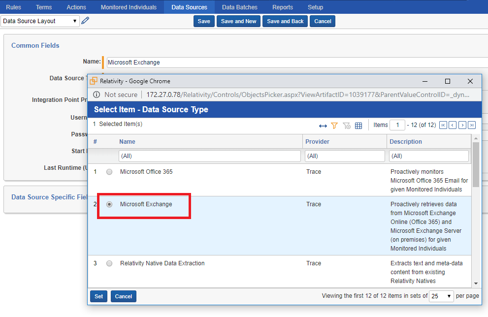

4.  Select Integration Point Profile created in **Step 1**

5.  Set the Username = username (usually an email address) of the admin user you
    will be using to retrieve emails (configured in Step 2)

6.  Set the Password = password of the admin user you will be using to retrieve
    emails

7.  Set Start Date to the earliest email timestamp you would like imported (UTC
    time)

8.  Under Data Source Specific Fields, set the Exchange Url and Exchange Version
    fields

    

    1.  Exchange Url gives you the chance to specify the exact URL used when
        connecting to your exchange server. If this field is left blank,
        Microsoft’s Autodiscover technology will be used to populate the field
        with a URL based on the credentials provided in the Username and
        Password fields. Autodiscover is typically a suitable option and works
        for Office 365 and many on premises solutions but it is not guaranteed
        to work.

    2.  Exchange Version allows you to specify the version of your exchange
        server. For Office 365, the default is the correct choice. For on
        premises servers, provide the correct version. It needs to be an exact
        match to one of the options, filling it out incorrectly will provide a
        list of all of the options available in the error message at the top of
        the page: Exchange2007_SP1, Exchange2010, Exchange2010_SP1,
        Exchange2010_SP2, Exchange2013, Exchange2013_SP1

9.  Click “Save”

10. Link / Create New Monitored Individuals (same page after clicking Save)


1.  Click “New” if the monitored individual is not already defined on another
    Data Source, or “Link” if the user has already been monitored in the past

2.  Microsoft Exchange Data Source will only pull data for linked Monitored
    Individuals (by identifier field: email address)

3.  Once everything is set up, click the Enable Data Source button on the upper
    right to begin pulling data

**Content**

The Microsoft Exchange Data Source works by pulling content directly from an
Exchange Server instance (Office 365 or On Premises) using Exchange Web Services
(EWS). The Data Source downloads the native (.eml) email files and then extracts
all information including email metadata, email body text, native attachments
and their metadata. Container attachment file types (zips and similar archives)
are automatically extracted into individual documents – e.g. zip with 10 word
(.docx) documents = 11 Relativity documents. In addition, images from email
content and each individual document are automatically expanded into separate
Relativity documents.

Please, refer to **Appendix B** for field descriptions.

### Relativity Native Data Extraction Data Source

This Data Source allows for automatic text extraction/expansion of previously
ingested documents with natives in Relativity. This data source will
automatically extract text, metadata and any children documents from
containers/archives for all documents in workspace that have Native file
imported and *Trace Data Enrichment Needed* field is set to *Yes:*


**Setup:**

1.  Integration Points Profile

    1.  Please, re-use profile creation steps documented for Microsoft Office
        365 Data Source above OR re-use existing “Microsoft Office 365 Profile”
        profile. Ensure import option is set to Append/Overlay.

2.  Create Relativity Native Data Extraction Data Source

    1.  Go to the Trace:Data Sources tab and Click the “New Data Source” button

    2.  Set the Name = for example, “Native Data Extraction”

    3.  Select Integration Point Profile created in Step 1

    4.  Select Data Source Type: “Relativity Native Data Extraction”

    5.  Ignore Username field

    6.  Ignore Password field

    7.  Ignore Start Date field

    8.  You have the option to leave the Data Source as Enabled or Disabled

3.  Fill out Data Source Specific Fields and click Save

    1.  Password Bank can be adjusted to specify known passwords to attempt
        while encountering protected native files

    2.  The rest of the fields are automatically pre-filled out with needed
        values

**Content**

Extracted text and metadata for submitted Native files and all children
documents expanded from containers/archives. Please, refer to **Appending B**
for field descriptions.

**Warning:** Containers with many children documents (and nested containers)
could produce significant number of expanded items in Relativity.

### Trace Monitored Individuals

Trace Monitored Individual is a Relativity Dynamic Object (RDO) that ships with
Trace application. It allows administrators to define an individual that can be
monitored by a Data Source by importing data that belongs to them. Monitored
Individuals can be linked to multiple Data Sources. Each individual Data Source
has its own logic to determine what data is retrieved based on the linked
Monitored Individuals. Monitored Individuals are also used as a unit of billing
by Relativity Trace. Generally a Relativity Trace license will specify a number
of Monitored Individuals available and the number of data sources they can be
used on.

**NOTE:** The only field on Monitored Individual currently used in application
logic is Identifier. All other fields are simply for display purposes. Each
Monitored Individual must have a unique value in the Identifier field. Typically
the Identifier is the employee’s email address. Identifier is **case-sensitive**
(e.g. <Test@test.com> and <test@test.com> are treated as two different email
addresses / identifiers)

### Trace Data Transformations

Trace Data Transformation is a Relativity Dynamic Object (RDO) that ships with
Trace application. It allows administrators to specify a way data should be
transformed while it is being imported by the data source. Currently there are
two types of Trace Data Transformations, Replace and Deduplication. Trace Data
Transformations are attached to a Data Source by clicking Link in the Data
Transformations section of the Data Source Layout.

### Replace Data Transformation

Data Transformations of type Replace allow you to strip exact blocks of text out
of the Extracted Text for any documents imported by the associated Data Source.
This allows for removal of things like email signatures and other frequently
occurring, benign text so that they do not match Terms. A Data Source can be
associated with multiple Data Transformations of type Replace.


### Deduplication Data Transformation

Data Transformations of type Deduplication prevent a Data Source from importing
a document if the same document already exists in the workspace. Only one Data
Transformation of type Deduplication should be associated with each Data Source.

Deduplication is driven by a SHA256 hashing algorithm that populates the Trace
Document Hash field on each document. If the document is an email, the algorithm
will hash together the sender, subject, recipients, sent date, email body and
attachment list to create the hash value. If the document is not an email, then
the hash will be done directly on the bytes of the file. It is possible to
configure the exact hashing algorithm used for emails, please contact the Trace
team for details on how to do this.

When additional documents are ingested (either within the same Data Batch or
different Data Batches), hashes will be compared to those on documents that
already exist in the workspace. If there is a match, the duplicate document will
not be ingested. Instead, the Trace Monitored Individuals field on the document
will be updated to include the Monitored Individual that was the source of the
duplicate in addition to the Monitored Individual that was the source of the
original.

Data Batches
------------

Data batch is a unit of ingestion work for Trace. It corresponds to a load file
on disk that needs to be imported with specific settings and field mappings. It
is a central tracking object for how the data was generated, normalized and
aggregated into load file. It provides status of the overall import process and
allows for deep audit history trail from “source” to Relativity.

Once a batch enters Ingestion process (when status is set to: “Ready For
Import”) Ingestion task will create an integration point from the configured
Data Source profile (this information includes import settings and field
mappings).


### Error Resolution Workflow and Retry

By default the batch will be automatically retried internally (up to 3 times) if
the data batch import was not completed. You can get the error details by
looking at “Error Details” of a specific batch with “Has Errors” set to yes. You
can manually mark the batch as “Abandoned” to indicate that it was manually
resolved or “Retry” it.

Data Batch objects have associated Mass Operations (and corresponding Data Batch
console UI buttons) to help with state resolution

1.  Retry – submit the batch to be retried by Trace

2.  Abandon – indicates the batch has been manually resolved and should not be
    treated as errored.

    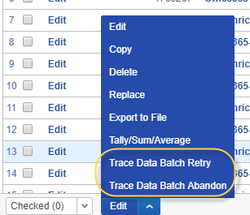

### Automatic Discovery of Monitored Individuals

For Data Source that are not shipped with Trace natived, application allows for
automatic discovery of monitored individuals based on EmailFrom, EmailTo,
EmailCC and EmailBCC fields.

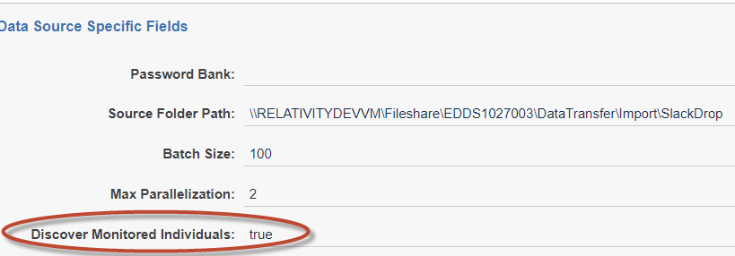

Please, contact <trace@relativity.com> in order to enable this feature.

Setup
=====

The Setup tab aggregates the most important information about configuration,
health and overall status of Trace for a workspace. It shows active tasks and
their configuration, and a snapshot of instance infrastructure that’s relevant
to Trace. In addition, you can manage Logging and License configuration and run
a built-in self-test (BIST) to verify basic flow.

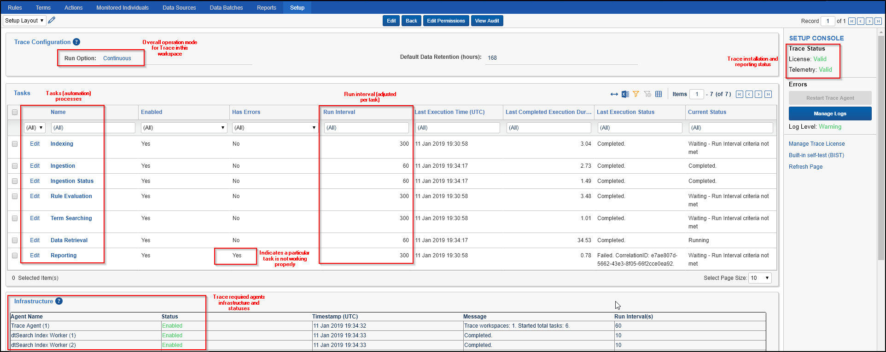

Tasks 
------

Tasks are ongoing background processes that are triggered by agents and run on
the agent servers. They each have Run Intervals and configurations can be
adjusted at a workspace level.

-   **Indexing:** Responsible for indexing data needed for searching

-   **Ingestion:** Responsible for triggering import of the Data Batches into
    Relativity (part of Proactive Ingestion Framework). Any Data Transformations
    configured for the corresponding Data Source will also be performed.

-   **Ingestion Status:** Responsible for updating statuses of the Data Batches
    (part of Proactive Ingestion Framework)

-   **Rule Evaluation:** Responsible for evaluating configured Rules within the
    workspace

-   **Term Searching:** Responsible for executing searching of the Terms for
    Rule evaluations

-   **Data Retrieval:** Responsible for pulling data for Data Sources and
    creation of Data Batches

-   **Reporting**: Responsible for reporting on the state of the system via
    email

Alerts and Notifications
------------------------

By default Reporting task will send out the system health report to the
configured instance email address every 24 hours. The defaults can be overridden
in the Reporting task Settings. See below sample configuration for example.


Sample Notification Configurations (on Reporting task)

**{**

"Reports"**: [{**

"Name"**:** "SystemHealthAlerts"**,**

"Recipients"**:**
"misha.kogan\@relativity.com;nikita.solilov\@relativity.com;jordan.domash\@relativity.com"**,**

"IncludeDetails"**: true,**

"FrequencyInMinutes"**:** "60",

"EmailFrom": "tracealerts\@relativity.com"

**}**

**]**

**}**

-   **Name:** Do not change

-   **Recipients:** List of emails to send the report to (default: configured
    email address in Instance Setting: “EmailTo” under “kCura.Notification”
    section

-   **IncludeDetails:** Flag to determine if you want to see the details in the
    email report (default: false)

-   **FrequencyInMinutes:** How often should an email report be sent out
    (default: 24hrs)

-   **EmailFrom:** Emails to send the report from (default: configured email
    address in Instance Setting: “EmailFrom” under “kCura.Notification” section

**NOTE:** It is required to fill in the kCura.Notification instance settings
with details about functioning email delivery system in order to receive
important notifications and alerts from Relativity and Trace.


Errors and Logging
------------------

You can adjust the logging level to get more information about the system
performance specific to Trace. Default level is Error. The management of the
Logging infrastructure can be adjusted via UI console button “Manage Logs”. In
order to adjust the logging level use “Update Trace Log Level” option. In order
to collect and display logging data use “Trace Logs” option. You can export the
logs to a csv file with a mass operation “Export to File” at the bottom of the
list.


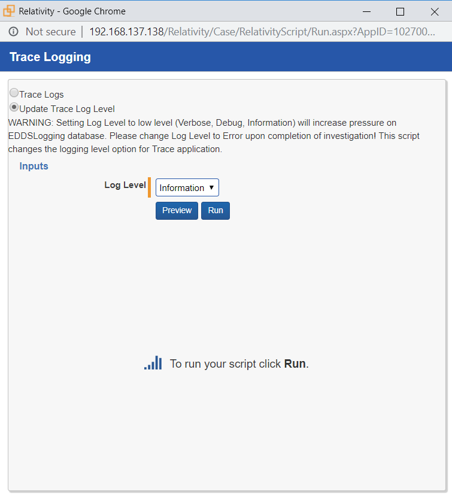


**CAUTION:** Verbose levels (information/debug) of Logging framework can
generate substantial load to default SQL configuration EDDSLogging database.
Don’t forget to adjust the levels once low level information is no longer
needed.

Reporting
=========

Trace:Reports tab serves as a place for reporting capabilities. We will be
adding more report to this section in the future.

Trace Terms Report
------------------

­­


This report provides distinct counts on how many documents matched per Rule per
Term. In other words, you can quickly see current state of your Rules and
associated terms.

**Note:** The report only works on Document date fields.

Considerations
==============

Usability Considerations
------------------------

-   Once a document is associated with a Rule, it will never be disassociated
    unless there are document updates to extracted text or metadata. Manual
    Trace Document Retry (mass operation) procedure will also reset the
    associations automatically.

-   Every Data Source has capability to be “reset”. Once a data source is reset,
    Trace will pull all available data again, beginning with the Start Date
    defined on the data source. **Depending on import profile settings, this
    could duplicate data in the Workspace.**

-   Task processes (Indexing, Term Searching, Rule Evaluation, etc) run
    asynchronously from each other. It may take several task cycles (based on
    configured ”Run Intervals” for the end-to-end workflow to complete fully.

-   Deleting the Rule does not delete any of the corresponding Relativity
    infrastructure and objects that were created (i.e. dtSearch Index, Saved
    Searches, Batch Sets). 

-   Global dtSearch index “Trace Search Index” (created by Trace application
    during installation) is supported for ad-hoc searching and will be
    incrementally built as part of Indexing task. No other dtSearch indexes will
    incrementally build automatically.

-   If Analytics Server is present, active and configured for the Relativity
    instance:

    -   If enabled, both “Trace Conceptual Analytics Index” and “Trace
        Classification Analytics Index” will incrementally build automatically.
        In order to enable this functionality, manually perform Full Build on
        each index.

    -   If enabled, “Trace Structured Analytics Set” will run on incremental
        data performing specified job options (by default: Language
        Identification). In order to enable this functionality, manually perform
        Full Analysis

Infrastructure and Environment Considerations
---------------------------------------------

| **Tasks:**                       | **Ingestion**                                                                          | **Running Rules**                                                                                                                                                                                   |                                                          |                                                                      |
|----------------------------------|----------------------------------------------------------------------------------------|-----------------------------------------------------------------------------------------------------------------------------------------------------------------------------------------------------|----------------------------------------------------------|----------------------------------------------------------------------|
|                                  | **Ingestion, Ingestion Status, and Data Retrieval**                                    | **Indexing**                                                                                                                                                                                        | **Term Searching**                                       | **Rule Evaluation**                                                  |
| Summary                          | Powers the Proactive Ingestion Framework                                               | Incrementally builds Trace Search Index and Temporary Search Indexes with batches of documents Optionally: Incrementally builds and runs Analytics Jobs (Conceptual, Classification and Structured) | Searches and tags Terms in workspace on an ongoing basis | Rule will run and tag all matching documents and perform actions     |
| Task Operations                  | *Ingestion Task*                                                                       | *Indexing Task*                                                                                                                                                                                     | *Term Searching Task*                                    | *Rule Evaluation Task*                                               |
| Recommended Run Interval         | 60 seconds                                                                             | 300 seconds                                                                                                                                                                                         | 300 seconds                                              | 300 seconds                                                          |
| Considerations and System Impact | Speed of ingestion is determined by number of Integration Points Agents (max of 4)     | Ongoing index builds use shared instance queue, agents and Fileshare across multiple workspaces (resource pool)                                                                                     |                                                          | Very complex/nested underlying Saved Searches can affect performance |
| Recommended Settings             | **Important**: Reach out to <trace@relativity.com> to adjust the Task “Settings” field |                                                                                                                                                                                                     |                                                          |                                                                      |

-   Looks for batches that need to be imported and kicks off import

-   Creates RIP job per batch

*Ingestion Status Task*

-   Updates Data Batch status

*Data Retrieval Task*

-   Pulls data for enabled Data Sources executed by Trace Agent

-   Kicks off dtSearch incremental build

-   Kicks off temporary (internal) dtSearch index builds for Term evaluation

-   Kicks off Analytics Jobs (if configured)

NOTE: Run Interval controls frequency of temp indexes creation ONLY. Global
dtSearch and Analytics Indexes are built every 60 minutes by default.

-   Runs (searches and tags) Terms in the workspace

NOTE: Each Term Searching run interval will search up to 5 available document
batches (default 10,000 documents per batch). These settings are configurable on
Term Searching task.

-   Evaluates each rule in the workspaces and triggers configured actions

-   Every incremental build makes the old build obsolete - cleaned up by Case
    Manager nightly

-   Saved Searches that return many documents can affect performance

-   Many rules being evaluated often can put pressure on SQL server

The Recommended Run Interval for the **Reporting Task** is 300 seconds.

System Recommendations for *current application version* when there is a **large
active ongoing project:**

| Recommendation                                                             | Explanation                                                                                                                                                                                                                | Additional Notes                                                                                    |
|----------------------------------------------------------------------------|----------------------------------------------------------------------------------------------------------------------------------------------------------------------------------------------------------------------------|-----------------------------------------------------------------------------------------------------|
| Separate dedicated infrastructure for Web, Agent, SQL server and Fileshare | Trace relies on Relativity infrastructure. In cases of shared resources (Agent Servers, Fileshares, SQL queues) it is recommended to dedicate separate infrastructure to limit effect on other workspaces within instance. | It is recommended to include these as a separate Resource Pool if deploying in existing environment |
| Limit Trace Task “Run Intervals” \>=5 minutes (300 seconds)                | Each Task generates audits, SQL queries executions, creates tables, etc. and can put unnecessary pressure on the system when run too frequently                                                                            | End-to-end workflow will require multiple Run Intervals for the cycle to complete                   |
| Limit maximum number of Rules: 50 per workspace, 500 per instance          | The design of Rule Evaluation Task limits concurrent execution of multiple rules. This effect is compounded by running multiple workspaces with Rules concurrently.                                                        | Future iterations will remove this limitation                                                       |

Glossary
========

-   **Action:** a customized activity that happens when a rule is triggered

-   **Action Type:** different activities have different Action Types which can
    be customized into Actions that are associated with a Rule

-   **Agent:** process manager that runs in the background of Relativity to
    complete tasks

-   **Data Source:** setup and settings needed for a particular data source
    (e.g. Bloomberg, Office 365, Lync, etc.…)

-   **Data Batch:** a set of data (typically a load file) that is generated by a
    data processor as part of the Proactive Ingestion Framework

-   **Rule:** a preconfigured set of triggers that run on a regular basis and
    kick off actions

-   **Task:** an ongoing background process that is triggered by an agent

-   **Term:** search (dtSearch) condition that can be applied to Rule evaluation
    to further cull down results

Appendix A: Trace Object Architecture
=====================================

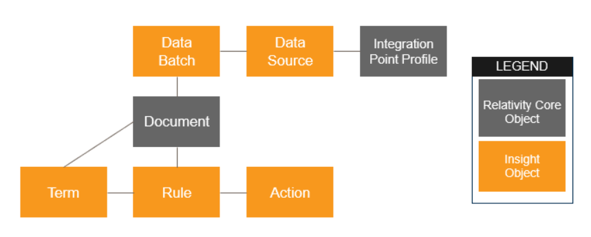

Appendix B: Trace Document Extraction Fields
============================================

Trace automatically extracts metadata information for Microsoft Office 365 Data
Source and Relativity Data Extraction Data Source. Below is the list of all the
supported fields. There are four major categories for fields:

-   Email Only – fields that apply to emails only

-   Email and Document – fields that apply to emails and other documents (Word,
    Excel, PowerPoint, etc.)

-   Document Only – fields that apply to documents but not to emails

-   Calculated – fields that are calculated dynamically by Trace

| **Trace Field Category**  | **Relativity Field**          | **Field Type**    | **Field Description**                                                                                                                                                                                                   |
|---------------------------|-------------------------------|-------------------|-------------------------------------------------------------------------------------------------------------------------------------------------------------------------------------------------------------------------|
| Email Only                | Attachment List               | Long Text         | Attachment file names of all child items in a family group, delimited by semicolon, only present on parent items.                                                                                                       |
| Email Only                | BCC                           | Long Text         | The name(s) (when available) and email address(es) of the Blind Carbon Copy recipient(s) of an email message.                                                                                                           |
| Email Only                | Can Forward                   | Yes/No            | The indicator whether the mail message can be forwarded.                                                                                                                                                                |
| Email Only                | CC                            | Long Text         | The name(s) (when available) and email address(es) of the Carbon Copy recipient(s) of an email message.                                                                                                                 |
| Email Only                | Conversation Index            | Long Text         | Email thread created by the email system. This is a 44-character string of numbers and letters that is created in the initial email and has 10 characters added for each reply or forward of an email.                  |
| Email Only                | Conversation                  | Long Text         | Normalized subject of email messages. This is the subject line of the email after removing the RE and FW that are added by the system when emails are forwarded or replied to.                                          |
| Email Only                | Creator Email Entry ID        | Long Text         | The unique Identifier of creator an email in an email store                                                                                                                                                             |
| Email Only                | Delivery Receipt Requested    | Yes/No            | The yes/no indicator of whether a delivery receipt was requested for an e-mail.                                                                                                                                         |
| Email Only                | Email Categories              | Long Text         | Category(ies) assigned to an email message.                                                                                                                                                                             |
| Email Only                | Email Created Date/Time       | Date              | The date and time at which an email was created.                                                                                                                                                                        |
| Email Only                | Email Format                  | Single Choice     | The indicator of whether an email is HTML, Rich Text, or Plain Text.                                                                                                                                                    |
| Email Only                | Email In Reply To ID          | Long Text         | The internal metadata value within an email for the reply to ID.                                                                                                                                                        |
| Email Only                | Email Last Modified Date/Time | Date              | Date and time that the email message last modified.                                                                                                                                                                     |
| Email Only                | Email Sensitivity             | Single Choice     | The indicator set on an email to denote the email's level of privacy.                                                                                                                                                   |
| Email Only                | From Address                  | Long Text         | The e-mail address for the messaging user represented by the sender.                                                                                                                                                    |
| Email Only                | From                          | Fixed-Length Text | The name (when available) and email address of the sender of an email message.                                                                                                                                          |
| Email Only                | From                          | Date              | Date and time that the email message was sent (according to original time zones).                                                                                                                                       |
| Email Only                | Importance                    | Single Choice     | Notation created for email messages to note a higher level of importance than other email messages added by the email originator.                                                                                       |
| Email Only                | Last Modifier Email Entry ID  | Long Text         | The unique Identifier of last modifier of an email in an mail store                                                                                                                                                     |
| Email Only                | Message Class                 | Single Choice     | A single choice field that can be one of: Email, Edoc, or Attach.                                                                                                                                                       |
| Email Only                | Message ID                    | Fixed-Length Text | The message number created by an email application and extracted from the email's metadata.                                                                                                                             |
| Email Only                | Priority                      | Single Choice     | The priority of the email message.                                                                                                                                                                                      |
| Email Only                | Read Receipt Requested        | Yes/No            | The yes/no indicator of whether a read receipt was requested for an e-mail.                                                                                                                                             |
| Email Only                | Received By Email Entry ID    | Long Text         | The unique Identifier of an email in an mail store                                                                                                                                                                      |
| Email Only                | Received Date/Time            | Date              | Date and time that the email message was received (according to original time zones).                                                                                                                                   |
| Email Only                | Sender Email Entry ID         | Long Text         | The unique Identifier of an email in an mail store                                                                                                                                                                      |
| Email Only                | Subject                       | Long Text         | Subject of the email message.                                                                                                                                                                                           |
| Email Only                | To                            | Long Text         | The name(s) (when available) and email address(es) of the recipient(s) of an email message.                                                                                                                             |
| Email and Document        | Author                        | Fixed-Length Text | Original composer of document or sender of email message.                                                                                                                                                               |
| Email and Document        | Created Date/Time             | Date              | Date and time from the Date Created property extracted from the original file or email message.                                                                                                                         |
| Email and Document        | Extracted Text                | Long Text         | Complete text extracted from content of electronic files or OCR data field. This field holds the hidden comments of MS Office files.                                                                                    |
| Document Only             | Comments                      | Long Text         | Comments extracted from the metadata of the native file.                                                                                                                                                                |
| Document Only             | Company                       | Fixed-Length Text | The internal value entered for the company associated with a Microsoft Office document.                                                                                                                                 |
| Document Only             | Document Subject              | Long Text         | Subject of the document extracted from the properties of the native file.                                                                                                                                               |
| Document Only             | Document Title                | Long Text         | The title of a non-email document. This is blank if there is no value available.                                                                                                                                        |
| Document Only             | Keywords                      | Long Text         | The internal value entered for keywords associated with a Microsoft Office document.                                                                                                                                    |
| Document Only             | Last Printed Date/Time        | Date              | Date and time that the document was last printed.                                                                                                                                                                       |
| Document Only             | Last Saved By                 | Fixed-Length Text | The internal value indicating the last user to save a document.                                                                                                                                                         |
| Document Only             | Last Saved Date/Time          | Date              | The internal value entered for the date and time at which a document was last saved.                                                                                                                                    |
| Calculated                | Container ID                  | Fixed-Length Text | Unique identifier of the container file in which the document originated. This is used to identify or group files that came from the same container.                                                                    |
| Calculated                | Container Name                | Fixed-Length Text | Name of the container file in which the document originated.                                                                                                                                                            |
| Calculated                | Control Number                | Fixed-Length Text | The identifier of the document.                                                                                                                                                                                         |
| Calculated                | Email Has Attachments         | Yes/No            | The yes/no indicator of whether an email has children (attachments).                                                                                                                                                    |
| Calculated                | Email Store Name              | Fixed-Length Text | Any email, contact, appointment, etc. that is extracted from an email container (PST, OST, NSF, MBOX, etc) will have this field populated with the name of that email container.                                        |
| Calculated                | Extracted Text Size in KB     | Decimal           | Indicates the size of the extracted text field in kilobytes                                                                                                                                                             |
| Calculated                | Family Group                  | Fixed-Length Text | Group the file belongs to (used to identify the group if attachment fields are not used). Formerly "Group Identifier"                                                                                                   |
| Calculated                | File Extension                | Fixed-Length Text | The extension of the file, as assigned by the processing engine after it reads the header information from the original file                                                                                            |
| Calculated                | File Name                     | Fixed-Length Text | The original name of the file                                                                                                                                                                                           |
| Calculated                | File Size                     | Decimal           | Generally a decimal number indicating the size in bytes of a file.                                                                                                                                                      |
| Calculated                | File Type                     | Fixed-Length Text | Description that represents the file type to the Windows Operating System                                                                                                                                               |
| Calculated                | Native File                   | Long Text         | The path to a copy of a file for loading into Relativity.                                                                                                                                                               |
| Calculated                | Number of Attachments         | Decimal           | Number of files attached to a parent document.                                                                                                                                                                          |
| Calculated                | Other Metadata                | Long Text         | Metadata extracted during processing for additional fields beyond the list of processing fields available for mapping                                                                                                   |
| Calculated                | Parent Document ID            | Fixed-Length Text | Document ID of the parent document. This field is only available on child items.                                                                                                                                        |
| Calculated                | Password Protected            | Single Choice     | Indicates the documents that were password protected. It contains the value Decrypted if the password was identified, Encrypted if the password was not identified, or no value if the file was not password protected. |
| Calculated                | Recipient Count               | Decimal           | The total count of recipients in an email which includes the To, CC, and BCC fields                                                                                                                                     |
| Calculated                | Trace Data Transformations    | Multiple Object   | Data Transformations that have been applied to the document                                                                                                                                                             |
| Calculated                | Trace Document Hash           | Fixed-Length Text | Calculated hash value that is used to determine if a document is a duplicate of another document                                                                                                                        |
| Calculated                | Trace Error Details           | Long Text         | Details of errors encountered during the extraction/expansion                                                                                                                                                           |
| Calculated                | Trace Has Errors              | Yes/No            | Indicates if any errors occurred during extraction/expansion                                                                                                                                                            |
| Calculated                | Trace Monitored Individuals   | Multiple Object   | Monitored individuals associated with Data Source (used for retrieval and billing)                                                                                                                                      |

Appendix C: Create Email Fields Map Integration Point Profile
=============================================================

**NOTE:** Make sure the Integration Points application is installed in this
Workspace before proceeding.

**NOTE:** Load File Templates are generated by Trace Agent **ONLY** in
workspaces that are enabled for “Continuous” run option in “Setup” tab.

**NOTE:** Trace uses default Relativity fields for email and attachment data
that ship with *Create & Map Field Catalog – Full* (v0.0.1.5+). You can install
it to the target workspace like any other application which will bring in all
the needed fields with standardized names that are easily auto-mapped via “Map
Fields” integration point profile feature. If you don’t see this application in
your library, reach out to trace\@relativity.com


1.  Go to the Integration Points: Integration Point Profile tab

2.  Click “New Integration Point Profile”

3.  On Page 1 (Setup):

    1.  Enter a name for the Profile “Email Fields Map Profile”

    2.  Type = “Import”

    3.  Source = “Load File”

    4.  Keep all other settings as Default and click “Next”

4.  On Page 2 (Connect to Source):

    1.  Fill in preferred Workspace Destination Folder

    2.  Import Source: Select the Load File Template in the “LoadFileTemplates”
        Folder that matches the Data Source type that will use this Integration
        Point Profile (example: Microsoft Exchange data source):

        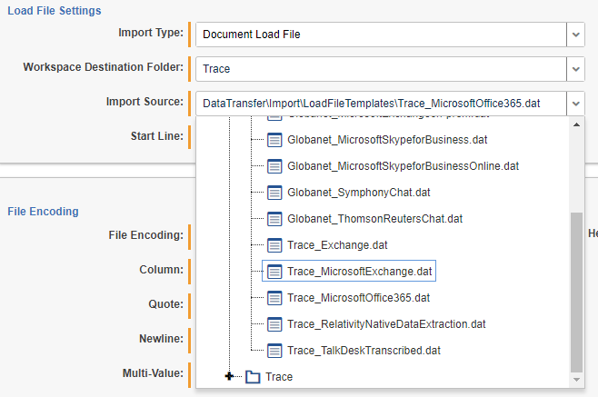

    3.  Change the Newline character to (ASCII: 010)

    4.  Keep all other settings as default and press “Next”

5.  On Page 3, map all the fields you need from the Load File Template to your
    Workspace fields and configure Settings.

    1.  Click the “Map Fields” button to map all fields in your Workspace that
        have identical names to fields from the Load File Template

    2.  Next, double-click Control Number in the Source (far left) list and then
        double-click Control Number in the Destination (far right) list to map
        the Control Number field.

    3.  Map any other unmapped fields in the Source list to the appropriate
        field in the Destination list. It is not required to map every field.
        For any missing fields in your Workspace, create them in the Workspace
        Administration: Fields Tab. See Appendix B: Load File Fields for Emails
        and Attachments for a list and associated definition for all Trace
        fields.

    4.  At the bottom, configure Settings to match the screenshot below

        

    5.  Press “Save”

**NOTE:** You can edit the Integration Point Profile settings at any time,
however existing completed Data Batches will not automatically re-import the
data with new settings/mappings.
